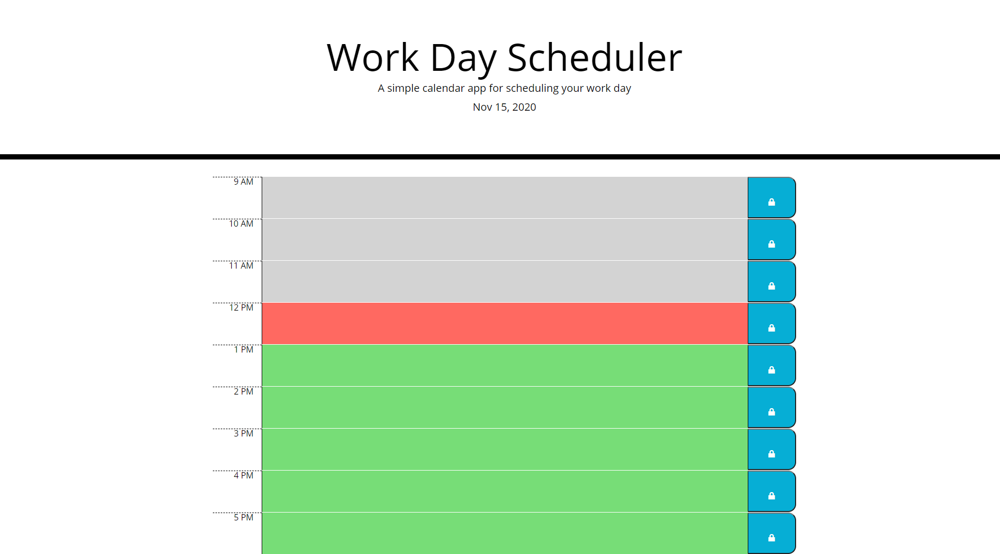

# Work Day Scheduler Starter Code

This is an interactive Work Day scheduler to keep your day on track. Maintain your daily events from 9AM to 5PM throughout the day event descriptions will turn different colors depending on whether they have passed, are ongoing or are in the future. Click on the color coded description to enter your event description and notes and then click the lock button next to it to save it to your day planner.

Link to the Application: <a href="https://jasmineakbari.github.io/work-day-scheduler/">https://jasmineakbari.github.io/work-day-scheduler/</a>

Web Application Screenshot: 

